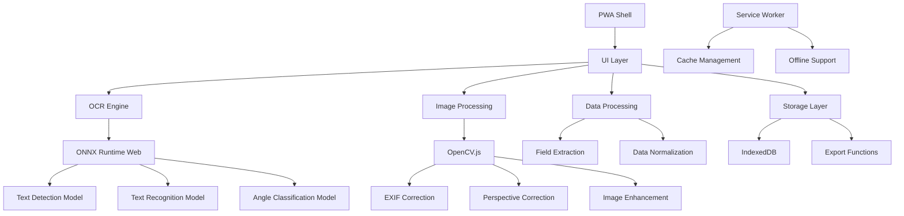

# 技術設計書

## 概要

スマートフォンブラウザ上で完全オフライン動作する領収書OCRアプリケーションの技術設計。ONNX Runtime WebとOpenCV.jsを使用した高性能なOCRパイプラインと、PWA技術によるオフライン対応を実現する。

## アーキテクチャ

### システム全体構成



### レイヤー構成

1. **プレゼンテーション層**: UI/UX、ユーザーインタラクション
2. **アプリケーション層**: OCRワークフロー、データ処理ロジック
3. **ドメイン層**: 領収書データモデル、ビジネスルール
4. **インフラストラクチャ層**: ONNX Runtime、OpenCV.js、IndexedDB

## コンポーネント設計

### 1. OCRエンジン (`OCREngine`)

#### 責務
- ONNX Runtime Webの初期化とバックエンド選択
- 検出→認識の2段階OCRパイプライン実行
- フォールバック機能（Tesseract.js）の管理

#### インターフェース
```javascript
/**
 * OCRエンジンのメインクラス
 */
class OCREngine {
  /**
   * @param {Object} config - 設定オブジェクト
   * @param {string} config.modelsPath - モデルファイルのパス
   * @param {Array<string>} config.backends - 優先バックエンドリスト
   */
  constructor(config)
  
  /**
   * エンジンの初期化
   * @returns {Promise<void>}
   */
  async initialize()
  
  /**
   * 画像からテキストを検出・認識
   * @param {ImageData} imageData - 処理対象の画像データ
   * @param {Object} options - オプション設定
   * @returns {Promise<OCRResult>}
   */
  async processImage(imageData, options = {})
  
  /**
   * 指定領域の再OCR
   * @param {ImageData} imageData - 元画像データ
   * @param {BoundingBox} region - 処理領域
   * @returns {Promise<OCRResult>}
   */
  async processRegion(imageData, region)
}
```

#### 実装詳細
- **バックエンド自動選択**: WebGPU → WebGL → WASM の順で利用可能性を検証
- **モデル遅延ロード**: 初回使用時にモデルファイルを動的ロード
- **ワーカー化**: 重い処理をWeb Workerで実行してUIスレッドをブロックしない
- **エラーハンドリング**: ONNX失敗時のTesseract.jsフォールバック

### 2. 画像処理モジュール (`ImageProcessor`)

#### 責務
- EXIF情報による回転補正
- 透視補正（自動推定 + 手動調整）
- 画像の前処理（二値化、ノイズ除去）

#### インターフェース
```javascript
/**
 * 画像処理クラス
 */
class ImageProcessor {
  /**
   * EXIF情報に基づく回転補正
   * @param {File} imageFile - 画像ファイル
   * @returns {Promise<ImageData>}
   */
  async correctOrientation(imageFile)
  
  /**
   * 透視補正の自動推定
   * @param {ImageData} imageData - 画像データ
   * @returns {Promise<{corners: Point[], corrected: ImageData}>}
   */
  async detectPerspective(imageData)
  
  /**
   * 手動調整による透視補正
   * @param {ImageData} imageData - 元画像
   * @param {Point[]} corners - 四隅の座標
   * @returns {Promise<ImageData>}
   */
  async correctPerspective(imageData, corners)
  
  /**
   * OCR用前処理
   * @param {ImageData} imageData - 画像データ
   * @returns {Promise<ImageData>}
   */
  async preprocessForOCR(imageData)
}
```

### 3. フィールド抽出エンジン (`FieldExtractor`)

#### 責務
- OCR結果から4項目（日付・支払先・金額・適用）の抽出
- 候補スコアリングとランキング
- データ正規化

#### インターフェース
```javascript
/**
 * フィールド抽出クラス
 */
class FieldExtractor {
  /**
   * OCR結果から構造化データを抽出
   * @param {OCRResult} ocrResult - OCR処理結果
   * @returns {Promise<ReceiptData>}
   */
  async extractFields(ocrResult)
  
  /**
   * 日付の正規化
   * @param {string} dateText - 日付テキスト
   * @returns {string} YYYY/MM/DD形式の日付
   */
  normalizeDate(dateText)
  
  /**
   * 金額の正規化
   * @param {string} amountText - 金額テキスト
   * @returns {number} 整数値の金額
   */
  normalizeAmount(amountText)
  
  /**
   * 支払先の推定
   * @param {TextBlock[]} textBlocks - テキストブロック配列
   * @returns {string} 支払先名
   */
  inferPayee(textBlocks)
  
  /**
   * 適用項目の要約
   * @param {TextBlock[]} textBlocks - テキストブロック配列
   * @returns {string} 適用内容の要約
   */
  summarizePurpose(textBlocks)
}
```

### 4. UIコンポーネント

#### 画像表示・操作コンポーネント (`ImageCanvas`)
- ズーム・パン機能
- 矩形選択オーバーレイ
- 透視補正の四隅ドラッグ操作

#### フォームコンポーネント (`ReceiptForm`)
- 4項目の入力フィールド
- 信頼度表示とアラート
- 候補履歴の表示・選択

#### 進行状況表示 (`ProgressIndicator`)
- OCR処理の進行状況
- エラー状態の表示

## データモデル

### ReceiptData
```javascript
/**
 * 領収書データモデル
 * @typedef {Object} ReceiptData
 * @property {FieldData} date - 日付フィールド
 * @property {FieldData} payee - 支払先フィールド
 * @property {FieldData} amount - 金額フィールド
 * @property {FieldData} purpose - 適用フィールド
 * @property {string} imageId - 画像ID
 * @property {Date} createdAt - 作成日時
 */

/**
 * フィールドデータ
 * @typedef {Object} FieldData
 * @property {string} value - 現在の値
 * @property {number} confidence - 信頼度 (0-1)
 * @property {Array<Candidate>} candidates - 候補リスト
 */

/**
 * 候補データ
 * @typedef {Object} Candidate
 * @property {string} value - 候補値
 * @property {number} confidence - 信頼度
 * @property {BoundingBox} boundingBox - 元画像での位置
 */
```

## エラーハンドリング

### エラー分類と対応

1. **初期化エラー**
   - ONNX Runtime初期化失敗 → Tesseract.jsフォールバック
   - モデルロード失敗 → ユーザーに再試行を促す

2. **処理エラー**
   - OCR処理失敗 → 部分的な結果を返す
   - メモリ不足 → 画像サイズを縮小して再試行

3. **権限エラー**
   - カメラアクセス拒否 → ファイル選択のみ提供
   - ストレージ制限 → 一時的なメモリ保存に切り替え

## テスト戦略

### ユニットテスト
- データ正規化関数の境界値テスト
- フィールド抽出ロジックの精度テスト
- エラーハンドリングの動作確認

### 統合テスト
- OCRパイプライン全体の動作確認
- 異なるブラウザでの互換性テスト
- オフライン動作の確認

### E2Eテスト
- 実際の領収書画像を使用した精度テスト
- ユーザーワークフローの動作確認
- パフォーマンステスト

## セキュリティ考慮事項

### Content Security Policy
```
default-src 'self';
script-src 'self' 'wasm-unsafe-eval';
worker-src 'self' blob:;
img-src 'self' blob: data:;
```

### Permissions Policy
```
camera=self, microphone=(), geolocation=()
```

### データ保護
- 画像データの暗号化保存
- 機密情報の自動削除機能
- ユーザー同意に基づく保存制御